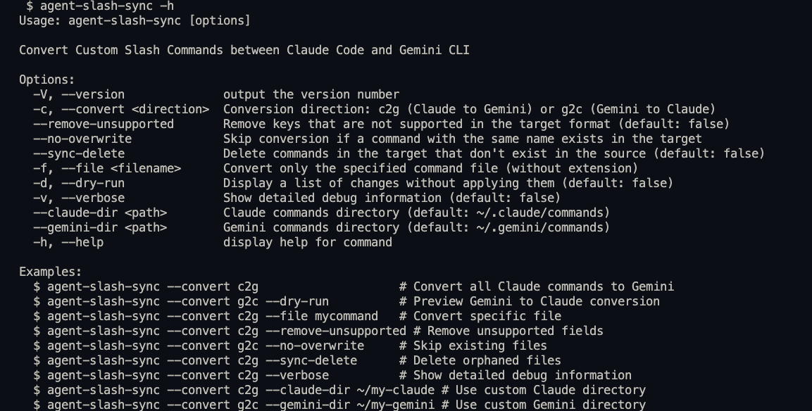
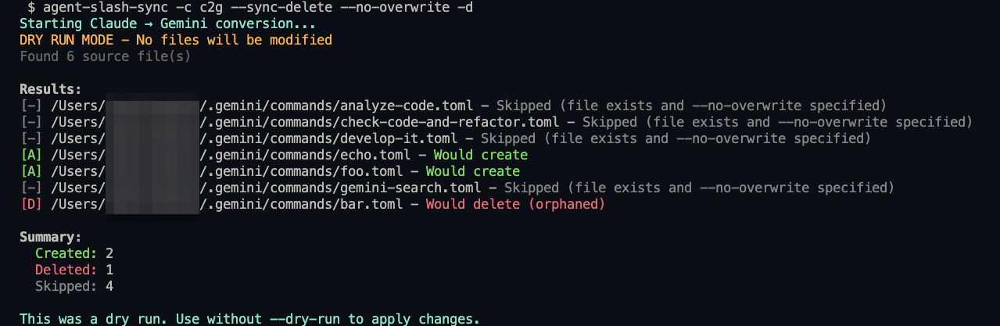

<div align="center"> <a href="README.md">en</a> | ja </div>

--------------------------------------------------------------------------------

# agent-slash-sync

[](https://www.npmjs.com/package/agent-slash-sync)
[](https://opensource.org/licenses/MIT)

Claude Code と Gemini CLI 間でカスタムスラッシュコマンドを双方向に変換・同期する、直感的なビジュアルフィードバック付きのツールです。

## インストール

```bash
npm install -g agent-slash-sync
```

## クイックスタート

```bash
# Claude Code → Gemini CLI に変換
assync -s claude -d gemini

# Gemini CLI → Claude Code に変換
assync -s gemini -d claude

# 適用前に変更をプレビュー
assync --dry-run -s claude -d gemini
```

## スクリーンショット

### 使用例


### 変換例


## 機能

- **カラフルな出力** - 色分けされたステータスインジケータによる明確なビジュアルフィードバック
- **高速変換** - Claude Code と Gemini CLI 間でコマンドを効率的に同期
- **双方向対応** - 両方向への変換に対応（Claude ↔ Gemini）
- **デフォルトで安全** - ドライランモードで適用前に変更をプレビュー
- **短縮コマンド** - `agent-slash-sync` の代わりに `assync` を使用可能
- **選択的同期** - 特定のファイルまたは全コマンドを一括変換

## オプション

| オプション                    | 説明                                                              |
| --------------------------- | --------------------------------------------------------------- |
| `-s, --src <product>`       | **必須。** ソース製品: `claude` または `gemini`                     |
| `-d, --dest <product>`      | **必須。** 宛先製品: `claude` または `gemini`                       |
| `-f, --file <filename>`     | 特定のファイルのみ変換（`.md`, `.toml` 拡張子をサポート）             |
| `--dry-run`                 | 変更を適用せずにプレビュー                                          |
| `-v, --verbose`             | 詳細なデバッグ情報を表示                                           |
| `--claude-dir <path>`       | Claude ベースディレクトリ（デフォルト: ~/.claude）                   |
| `--gemini-dir <path>`       | Gemini ベースディレクトリ（デフォルト: ~/.gemini）                   |
| `--no-overwrite`            | ターゲットディレクトリの既存ファイルをスキップ                         |
| `--sync-delete`             | ターゲットディレクトリの孤立ファイルを削除                            |
| `--remove-unsupported`      | ターゲット形式でサポートされていないフィールドを削除                    |

## 使用例

```bash
# プレビュー付きで全コマンドを変換
assync --dry-run -s claude -d gemini

# 特定のファイルを変換
assync -s gemini -d claude -f analyze-code

# クリーンアップ付きの完全同期
assync -s claude -d gemini --sync-delete --remove-unsupported

# カスタムディレクトリを使用（ベースディレクトリを指定、/commands は自動的に追加されます）
assync -s claude -d gemini --claude-dir ~/my-claude --gemini-dir ~/my-gemini

# デバッグ用の詳細出力を表示
assync -s claude -d gemini -v
```

## ファイルの場所

- **Claude Code**: `~/.claude/commands/*.md`
- **Gemini CLI**: `~/.gemini/commands/*.toml`

## 形式変換

| Claude Code                               | Gemini CLI    | 備考                                            |
| ----------------------------------------- | ------------- | ----------------------------------------------- |
| Markdown コンテンツ                         | `prompt`      | メインコマンドの内容                               |
| Frontmatter の `description`               | `description` | コマンドの説明                                    |
| `$ARGUMENTS`                              | `{{args}}`    | 引数プレースホルダー                                |
| `!command`                                | `!{command}`  | シェルコマンド構文                                  |
| `allowed-tools`, `argument-hint`, `model` | -             | Claude 固有（`--remove-unsupported` を使用して削除）|

## ステータスインジケータ

- `[A]` 作成（緑） - ターゲットディレクトリに新規ファイル作成
- `[M]` 更新（黄） - 既存ファイルを更新
- `[D]` 削除（赤） - `--sync-delete` でファイル削除
- `[-]` スキップ（グレー） - `--no-overwrite` でファイルをスキップ

## 必要環境

- Node.js >= 18.0.0
- npm または互換性のあるパッケージマネージャー

## 開発

```bash
# 依存関係をインストール
npm install

# プロジェクトをビルド
npm run build

# テストを実行
npm test

# カバレッジ付きでテストを実行
npm run test:coverage

# コードのリントとフォーマット
npm run lint
npm run format

# 型チェック
npm run lint:tsc

# 開発モード（ウォッチ）
npm run dev
```

### パブリッシング

```bash
# パッケージ内容を確認
npm run release:dry

# パッチバージョンをパブリッシュ（1.0.0 → 1.0.1）
npm run release:patch

# マイナーバージョンをパブリッシュ（1.0.0 → 1.1.0）
npm run release:minor

# メジャーバージョンをパブリッシュ（1.0.0 → 2.0.0）
npm run release:major
```

## ライセンス

MIT