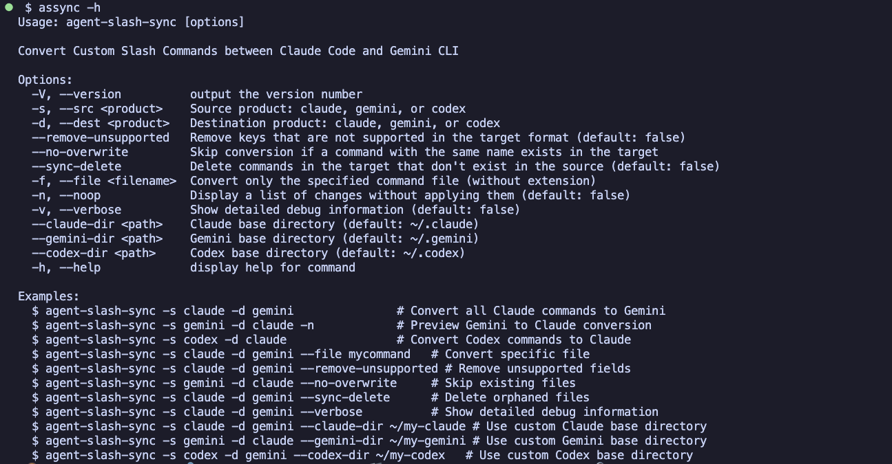
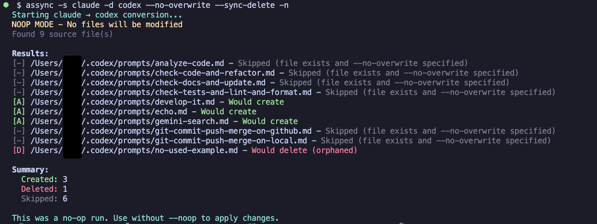

<div align="center"> <a href="README.md">en</a> | ja </div>

--------------------------------------------------------------------------------

# agent-command-sync

[](https://www.npmjs.com/package/agent-command-sync)
[](https://opensource.org/licenses/MIT)

Claude Code、Gemini CLI、Codex CLI 間でカスタムスラッシュコマンドを双方向に変換・同期する、直感的なビジュアルフィードバック付きのツールです。

## CHANGELOG

[CHANGELOG_ja.txt](CHANGELOG_ja.txt)

## インストール

```bash
npm install -g agent-command-sync
```

## クイックスタート

```bash
# Claude Code → Gemini CLI に変換
acsync -s claude -d gemini

# Gemini CLI → Claude Code に変換
acsync -s gemini -d claude

# 適用前に変更をプレビュー
acsync -n -s claude -d gemini
```

## スクリーンショット

### 使用例


### 変換例


## 機能

- **カラフルな出力** - 色分けされたステータスインジケータによる明確なビジュアルフィードバック
- **高速変換** - Claude Code と Gemini CLI 間でコマンドを効率的に同期
- **双方向対応** - 両方向への変換に対応（Claude ↔ Gemini）
- **デフォルトで安全** - ドライランモードで適用前に変更をプレビュー
- **短縮コマンド** - `agent-command-sync` の代わりに `acsync` を使用可能
- **選択的同期** - 特定のファイルまたは全コマンドを一括変換

## オプション

| オプション                    | 説明                                                                     |
| --------------------------- | ----------------------------------------------------------------------- |
| `-s, --src <product>`       | **必須。** ソース製品: `claude`、`gemini`、または `codex`                   |
| `-d, --dest <product>`      | **必須。** 宛先製品: `claude`、`gemini`、または `codex`                     |
| `-f, --file <filename>`     | 特定のファイルのみ変換（`.md`, `.toml` 拡張子をサポート）                    |
| `-n, --noop`                | 変更を適用せずにプレビュー                                                 |
| `-v, --verbose`             | 詳細なデバッグ情報を表示                                                  |
| `--claude-dir <path>`       | Claude ベースディレクトリ（デフォルト: ~/.claude）                          |
| `--gemini-dir <path>`       | Gemini ベースディレクトリ（デフォルト: ~/.gemini）                          |
| `--codex-dir <path>`        | Codex ベースディレクトリ（デフォルト: ~/.codex）                           |
| `--no-overwrite`            | ターゲットディレクトリの既存ファイルをスキップ                                |
| `--sync-delete`             | ターゲットディレクトリの孤立ファイルを削除                                   |
| `--remove-unsupported`      | ターゲット形式でサポートされていないフィールドを削除                           |

## 使用例

```bash
# プレビュー付きで全コマンドを変換
acsync -n -s claude -d gemini

# 特定のファイルを変換
acsync -s gemini -d claude -f analyze-code

# クリーンアップ付きの完全同期
acsync -s claude -d gemini --sync-delete --remove-unsupported

# カスタムディレクトリを使用（ベースディレクトリを指定、/commands は自動的に追加されます）
acsync -s claude -d gemini --claude-dir ~/my-claude --gemini-dir ~/my-gemini

# デバッグ用の詳細出力を表示
acsync -s claude -d gemini -v
```

## デフォルトのファイルの場所

- **Claude Code**: `~/.claude/commands/*.md`
- **Gemini CLI**: `~/.gemini/commands/*.toml`
- **Codex CLI**: `~/.codex/prompts/*.md`

## 形式比較と変換仕様

### ファイル構造とメタデータ

| 機能                                      | Claude Code   | Gemini CLI    | Codex CLI     | 変換メモ                                      |
| ----------------------------------------- | ------------- | ------------- | ------------- | -------------------------------------------- |
| ファイル形式                               | Markdown      | TOML          | Markdown      | 自動変換                                     |
| コンテンツフィールド                        | 本文コンテンツ  | `prompt`      | 本文コンテンツ  | メインコマンドの内容                           |
| 説明メタデータ                            | `description` | `description` | `description` | 形式間で保持                                  |
| `allowed-tools`, `argument-hint`, `model` | サポート       | -             | -             | Claude固有（`--remove-unsupported`を使用して削除）|

### コンテンツプレースホルダーと構文

| 機能                  | Claude Code    | Gemini CLI     | Codex CLI      | 変換動作                               |
| -------------------- | -------------- | -------------- | -------------- | ------------------------------------- |
| すべての引数          | `$ARGUMENTS`   | `{{args}}`     | `$ARGUMENTS`   | 形式間で変換                           |
| 個別引数              | `$1` ... `$9`  | -              | `$1` ... `$9`  | そのまま保持（Geminiはサポートなし）      |
| シェルコマンド        | `!command`     | `!{command}`   | -              | Claude/Gemini間で変換                  |
| ファイル参照          | `@path/to/file`| `@{path/to/file}` | -           | Claude/Gemini間で変換                  |

#### 個別引数
プレースホルダー `$1` から `$9` は、個々のコマンド引数を参照できます。例えば、`$1` は最初の引数、`$2` は2番目の引数を参照します。この機能はClaude CodeとCodex CLIでサポートされていますが、Gemini CLIではサポートされていません。変換時、これらのプレースホルダーはそのまま保持されます。

#### ファイル参照
ファイル参照を使用すると、コマンド内にファイルの内容をインラインで埋め込むことができます。ツール間で構文が異なります：
- Claude Codeは `@path/to/file.txt` を使用
- Gemini CLIは `@{path/to/file.txt}` を使用
- Codex CLIはこの機能をサポートしていません

ClaudeとGemini間の変換では、構文が自動的に変換されます。Codexとの変換では、ファイル参照構文はそのまま保持されます。

### 公式ドキュメント

- [Slash commands - Claude Docs](https://docs.claude.com/en/docs/claude-code/slash-commands)
- [gemini-cli/docs/cli/custom-commands.md at main · google-gemini/gemini-cli](https://github.com/google-gemini/gemini-cli/blob/main/docs/cli/custom-commands.md)
- [codex/docs/prompts.md at main · openai/codex](https://github.com/openai/codex/blob/main/docs/prompts.md)

## ステータスインジケータ

- `[A]` 作成（緑） - ターゲットディレクトリに新規ファイル作成
- `[M]` 更新（黄） - 既存ファイルを更新
- `[D]` 削除（赤） - `--sync-delete` でファイル削除
- `[-]` スキップ（グレー） - `--no-overwrite` でファイルをスキップ

## 必要環境

- Node.js >= 18.0.0
- npm または互換性のあるパッケージマネージャー

## 開発

```bash
# 依存関係をインストール
npm install

# プロジェクトをビルド
npm run build

# テストを実行
npm test

# カバレッジ付きでテストを実行
npm run test:coverage

# コードのリントとフォーマット
npm run lint
npm run format

# 型チェック
npm run lint:tsc

# 開発モード（ウォッチ）
npm run dev

# 実行
node dist/cli/index.js
```

### パブリッシング

```bash
# パッケージ内容を確認
npm run release:dry

# パッチバージョンをパブリッシュ（1.0.0 → 1.0.1）
npm run release:patch

# マイナーバージョンをパブリッシュ（1.0.0 → 1.1.0）
npm run release:minor

# メジャーバージョンをパブリッシュ（1.0.0 → 2.0.0）
npm run release:major
```

## ライセンス

MIT